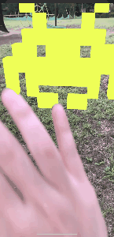
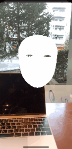
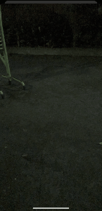

# ARKit-Invader

ARKit-Invader is a collection of ARKit3 samples.

## How to build

1.Download this Repository

2.Open `ARKit-Invader.xcodeproj` with Xcode 11 and build it.

※It can **NOT** run on **Simulator**. Most functions require an A12 chip.

## Contents

### Coaching UI
環境データ取得用のアニメーションを表示させる機能。

A function to display an animation for acquiring environmental data.

### People Occlusion 2D
ユーザーの身体を、3Dオブジェクトの手前に表示させる機能。

A function that displays the user's body in front of 3D objects.

### People Occlusion 3D
ユーザーの身体と3Dオブジェクトの前後関係を、反映・表示させる機能。

A function that reflects and displays the context of the user's body and 3D objects.

### Motion Capture 2D
ユーザーの身体/関節の位置を画面上の位置座標で取得出来る機能。

A function that can acquire the position of the user's body / joint using the position coordinates on the screen.

### Motion Capture 3D
ユーザーの身体/関節の位置を空間座標で取得出来る機能。

A function that can acquire the position of the user's body / joint in spatial coordinates.

### Multiple Face Tracking
３人までの顔の場所と表情を同時追跡する機能。

A function that simultaneously tracks the location and facial expression of up to three people.

### Simultaneous Front and Back Camera
手前側のカメラと背面側のカメラで同時にARを利用出来る機能。

A function that allows AR to be used simultaneously with the front and rear cameras.

### Collaborative Sessions
他のユーザーとのAR体験の共有を補助する機能

Ability to help share AR experiences with other users

## Details
 
 Qiita
https://qiita.com/1901drama/

