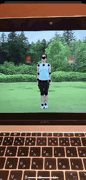
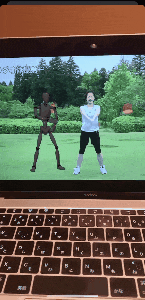

# ARKit-Invader

ARKit-Invader is a collection of ARKit3 samples.

# How to build

1.Download this Repository.

2.Open `ARKit-Invader.xcodeproj` with Xcode 11 and build it.

※It can **NOT** run on **Simulator**. Most functions require an A12 chip.

# Contents

## Coaching UI

A function to display an animation for acquiring environmental data.

【Sample】[CoachingUI_ViewController.swift](https://github.com/1901drama/ARKit-Invader/blob/master/ARKit-Invader/Menu/CoachingUI_ViewController.swift)
【Document】[ARCoachingOverlayView](https://developer.apple.com/documentation/arkit/arcoachingoverlayview)

## People Occlusion 2D

A function that displays the user's body in front of 3D objects.

【Sample】[PeopleOcclusion2D_ViewController.swift](https://github.com/1901drama/ARKit-Invader/blob/master/ARKit-Invader/Menu/PeopleOcclusion2D_ViewController.swift)
【Document】[personSegmentation](https://developer.apple.com/documentation/arkit/arconfiguration/framesemantics/3089125-personsegmentation)

## People Occlusion 3D

A function that reflects and displays the context of the user's body and 3D objects.

【Sample】[PeopleOcclusion3D_ViewController.swift](https://github.com/1901drama/ARKit-Invader/blob/master/ARKit-Invader/Menu/PeopleOcclusion3D_ViewController.swift)
【Document】[personSegmentationWithDepth](https://developer.apple.com/documentation/arkit/arconfiguration/framesemantics/3194576-personsegmentationwithdepth)

## Motion Capture 2D

([参考：ラジオ体操第一・実演](https://www.youtube.com/watch?v=_YZZfaMGEOU))

A function that can acquire the position of the user's body / joint using the position coordinates on the screen.

【Sample】[MotionCapture2D_ViewController.swift](https://github.com/1901drama/ARKit-Invader/blob/master/ARKit-Invader/Menu/MotionCapture2D_ViewController.swift)
【Document】[bodyDetection](https://developer.apple.com/documentation/arkit/arconfiguration/framesemantics/3214027-bodydetection)

## Motion Capture 3D

([参考：ラジオ体操第一・実演](https://www.youtube.com/watch?v=_YZZfaMGEOU))

A function that can acquire the position of the user's body / joint in spatial coordinates.

【Sample】[MotionCapture3D_ViewController.swift](https://github.com/1901drama/ARKit-Invader/blob/master/ARKit-Invader/Menu/MotionCapture3D_ViewController.swift)
【Document】[ARBodyTrackingConfiguration](https://developer.apple.com/documentation/arkit/arbodytrackingconfiguration)

## Multiple Face Tracking

A function that simultaneously tracks the location and facial expression of up to three people.

【Sample】[MultipleFaceTracking_ViewController.swift](https://github.com/1901drama/ARKit-Invader/blob/master/ARKit-Invader/Menu/MultipleFaceTracking_ViewController.swift)
【Document】[maximumNumberOfTrackedFaces](https://developer.apple.com/documentation/arkit/arfacetrackingconfiguration/3192187-maximumnumberoftrackedfaces)

## Simultaneous Front and Back Camera

A function that allows AR to be used simultaneously with the front and rear cameras.

【Sample】[SimultaneousCamera_ViewController.swift](https://github.com/1901drama/ARKit-Invader/blob/master/ARKit-Invader/Menu/SimultaneousCamera_ViewController.swift)
【Document】[supportsUserFaceTracking](https://developer.apple.com/documentation/arkit/arworldtrackingconfiguration/3223421-supportsuserfacetracking)

## Collaborative Sessions

Ability to help share AR experiences with other users.

【Sample】[CollaborativeSessions_ViewController.swift](https://github.com/1901drama/ARKit-Invader/blob/master/ARKit-Invader/Menu/CollaborativeSessions_ViewController.swift)
【Document】[isCollaborationEnabled](https://developer.apple.com/documentation/arkit/arworldtrackingconfiguration/3152987-iscollaborationenabled), [MultipeerConnectivity
](https://developer.apple.com/documentation/multipeerconnectivity)([Creating a Multiuser AR Experience](https://developer.apple.com/documentation/arkit/creating_a_multiuser_ar_experience))

# Details

Qiita https://qiita.com/1901drama/

GitHub https://github.com/1901drama/ARKit-Invader

☆ (star), 👍 (like) etc. If you can give feedback, I will do my best, so thank you!
